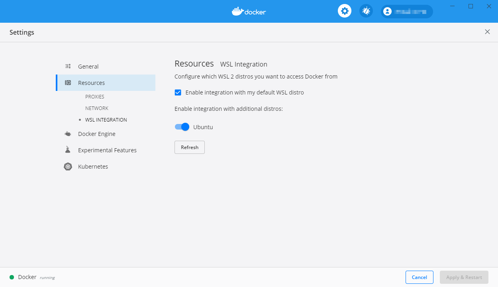

# Setup CKAN

- [Setup CKAN](#setup-ckan)
  - [Linux](#linux)
    - [Install Docker](#install-docker)
    - [Install docker-compose](#install-docker-compose)
  - [Windows](#windows)
    - [Docker Desktop + WSL Integration](#docker-desktop--wsl-integration)
    - [Windows Terminal](#windows-terminal)
  - [Download CKAN git repo and submodules](#download-ckan-git-repo-and-submodules)
  - [Create config files](#create-config-files)
    - [Installing CKAN as the root website](#installing-ckan-as-the-root-website)
    - [Installing CKAN off the root of a website](#installing-ckan-off-the-root-of-a-website)
    - [Configuring pyCSW](#configuring-pycsw)
  - [Build CKAN](#build-ckan)
    - [Create CKAN admin user](#create-ckan-admin-user)
  - [Configure admin settings](#configure-admin-settings)
  - [Setup Apache proxy](#setup-apache-proxy)
    - [Install Apache](#install-apache)
    - [Enable Compression in Apache](#enable-compression-in-apache)
    - [Configure Proxy Settings](#configure-proxy-settings)
    - [Redirect HTTP to HTTPS](#redirect-http-to-https)
    - [Mitigate SELinux Problems](#mitigate-selinux-problems)
    - [Restart Apache](#restart-apache)
  - [Setup Harvesters](#setup-harvesters)
    - [CSW (geonetwork)](#csw-geonetwork)
    - [WAF (ERDDAP)](#waf-erddap)
    - [19115-3 WAF (ERDDAP)](#19115-3-waf-erddap)
    - [CKAN](#ckan)
    - [Reindex Harvesters](#reindex-harvesters)
  - [Finish setting up pyCSW](#finish-setting-up-pycsw)
    - [Test GetCapabilities](#test-getcapabilities)
    - [Useful pyCSW commands](#useful-pycsw-commands)
    - [Errors while pyCSW loading](#errors-while-pycsw-loading)
  - [Update SOLR schema](#update-solr-schema)
  - [Update CKAN](#update-ckan)
  - [Update CKAN extensions](#update-ckan-extensions)
  - [Other helpful commands](#other-helpful-commands)
    - [Update a system file in a running container](#update-a-system-file-in-a-running-container)
    - [Set timezone](#set-timezone)
    - [Flush email notifications](#flush-email-notifications)
    - [Get public IP of server](#get-public-ip-of-server)
    - [Update language translation files](#update-language-translation-files)
    - [Add DHCP entries to docker container](#add-dhcp-entries-to-docker-container)
    - [Reindex if project was already installed / running](#reindex-if-project-was-already-installed--running)
  - [Customize interface](#customize-interface)
  - [Enable Google Analytics](#enable-google-analytics)
  - [Troubleshooting](#troubleshooting)
    - [Issues building/starting CKAN](#issues-buildingstarting-ckan)
    - [Changes to production.ini](#changes-to-productionini)
      - [Linux](#linux-1)
      - [Windows](#windows-1)
    - [Is CKAN running?](#is-ckan-running)
    - [Connect to container as root to debug](#connect-to-container-as-root-to-debug)
    - [No records are showing up](#no-records-are-showing-up)
    - [Running out of hard drive space?](#running-out-of-hard-drive-space)
    - [Errors when building CKAN](#errors-when-building-ckan)
    - [When changing harvester config it does not take affect](#when-changing-harvester-config-it-does-not-take-affect)
    - [500 Internal Server Error - when creating organizations or updating admin config settings](#500-internal-server-error---when-creating-organizations-or-updating-admin-config-settings)
    - [Build fails with 'Temporary failure resolving...' errors](#build-fails-with-temporary-failure-resolving-errors)
    - [Saving the admin config via the gui causes an internal server errors](#saving-the-admin-config-via-the-gui-causes-an-internal-server-errors)
    - [Error when Starting CKAN: "from osgeo import ogr ImportError: No module named osgeo"](#error-when-starting-ckan-from-osgeo-import-ogr-importerror-no-module-named-osgeo)

## Linux

These instructions are for CentOS 7.  They have been modified from the original ['Installing CKAN with Docker Compose'](https://docs.ckan.org/en/2.8/maintaining/installing/install-from-docker-compose.html) instructions.

### Install Docker

```
sudo apt-get update
sudo apt-get install docker
```

#### Install latest docker-compose

```bash
sudo curl -L "https://github.com/docker/compose/releases/download/1.22.0/docker-compose-$(uname -s)-$(uname -m)" -o /usr/local/bin/docker-compose
sudo chmod +x /usr/local/bin/docker-compose
docker-compose --version
```

#### Install Apache

If proxying docker behind Apache (recommended) you will need to have that installed as well. nginx will also work but is not covered in this guide.

```
sudo apt-get update
sudo apt-get install docker-compose
```

#### Add Apache modules

We will use apache to proxy our docker containers so will need a few modules to make that work

```
sudo a2enmod ssl
sudo a2enmod proxy
sudo a2enmod proxy_http
sudo service apache2 restart
```

## Windows

It is possible to setup CKAN under Windows 10 using:

- [Windows Subsystem for Linux](https://docs.microsoft.com/en-us/windows/wsl/install-win10), Version 2 (WSL2) and
- [Docker Desktop](https://www.docker.com/products/docker-desktop)

This is useful for development purposes but has not been tested for production environments.

> **NOTE:** It is technically possible to get CKAN to run using WSL Version 1, however, it is much harder to get running and more prone to instability and other problems.  If your system can run WSL 2 you should shoot for that or, alternatively, use a proper Linux environment.

Once WSL 2 has been installed you'll need to select a Linux distro to use, Ubuntu has been tested under this configuration and performs well.  It tends to have Docker and Docker Compose already installed.

After WSL 2 and your distro of choice have been installed, install Docker Desktop.

### Docker Desktop + WSL Integration

**Optional, but recommend:**

When Docker Desktop is installed you can make your life easier by enabling WSL Integration.

> This will allow you to view many aspects of the containers & applications running in docker as well start/stop/restart/delete them, and enter a CLI environment inside a running container from the dashboard.

Open Docker Desktop, Open Settings and enable WSL Integration under the Resources section as illustrated below:



### Windows Terminal

#### Download CKAN git repo

```bash
git clone -b cioos https://github.com/cioos-siooc/ckan.git
cd ckan
git checkout cioos
```

add submodules

```
cd ~/ckan
git submodule init
git submodule update
```

## Create config files

create environment file and populate with appropriate values

```bash
cd ~/ckan/contrib/docker/
cp .env.template .env
nano .env
```

create ckan config files for later import into ckan

If your CKAN installation will run at the root of your domain, for example <http://yourdomain.com/>

```bash
cd ~/ckan/contrib/docker/
cp production_non_root_url.ini production.ini
cp who_non_root_url.ini who.ini
```

### Installing CKAN off the root of a website

Use this setup if your site will run at <http://yourdomain.com/ckan>

```bash
cd ~/ckan/contrib/docker/
cp production_root_url.ini production.ini
cp who_root_url.ini who.ini
```

copy pyCSW config file and update the database password. This ist he same password enetered in your .env file

```bash
cd ~/ckan/contrib/docker/pycsw
cp pycsw.cfg.template pycsw.cfg
nano pycsw.cfg
```

## Build CKAN

Change to ckan docker config folder

```bash
  cd ~/ckan/contrib/docker
```

Build containers

```bash
  sudo docker-compose up -d --build
```

if this fails try manually pulling the images first e.g.:

```bash
curl localhost:5000
```

Sometimes the containers start in the wrong order. This often results in strange sql errors in the db logs. If this happens you can manually start the containers by first building then using docker-compose up

```
sudo docker-compose build
sudo docker-compose up db
sudo docker-compose up solr redis
sudo docker-compose up ckan
sudo docker-compose up datapusher
sudo docker-compose up ckan_gather_harvester ckan_fetch_harvester ckan_run_harvester
```

if you need to change the production.ini in the repo and rebuild then you may need to delete the volume first. volume does not update during dockerfile run if it already exists.

```
docker-compose down
docker volume rm docker_ckan_config
```

update ckan/contrib/docker/production.ini

```
  export VOL_CKAN_CONFIG=`sudo docker volume inspect docker_ckan_config | jq -r -c '.[] | .Mountpoint'`
  sudo nano $VOL_CKAN_CONFIG/production.ini
```

#### Setup Apache proxy

add the following to your sites configs

```
    # CKAN
		<location /ckan>
  	    ProxyPass http://localhost:5000/
  	    ProxyPassReverse http://localhost:5000/
   	</location>

    # pycsw
     <location /ckan/csw>
         ProxyPass http://localhost:8000/pycsw/csw.js
         ProxyPassReverse http://localhost:8000/pycsw/csw.js
    </location>
```

or

```
    # CKAN
    <location />
        ProxyPass http://localhost:5000/
        ProxyPassReverse http://localhost:5000/
    </location>

    # pycsw
    <location /csw>
        ProxyPass http://localhost:8000/pycsw/csw.js
        ProxyPassReverse http://localhost:8000/pycsw/csw.js
    </location>

```

If you use rewrite rules to redirect none ssl traffic to https and you are using a non-root install, such as /ckan, then you will likely need to add a no escape flag to your rewrite rules. something like the following should work, note the NE.

```
  RewriteEngine on
  ReWriteCond %{SERVER_PORT} !^443$
  RewriteRule ^/(.*) https://%{HTTP_HOST}/$1 [NC,R,L,NE]
```

restart apache

```
  sudo service apache2 restart
```

### Create CKAN admin user

CKAN doesn't start with an admin user so it must be created via command line.  The last argument in the command below is where the username has been specified.  If you'd prefer another username swap out "admin" at the end of the command for your desired username.

You'll be asked to supply an email address and a password (8 characters in length minimum) and then to confirm the password.

```bash
sudo docker exec -it ckan ckan --config /etc/ckan/production.ini sysadmin add admin
```

> **NOTE:** You'll receive warnings about Python 2 no longer being supported, you can safely ignore these for now - they will go away when the base version of CKAN is migrated to one that supports Python 3.
### Update shared secrets and app uuid
In production.ini, update beaker.session.secret and app_instance_uuid values. These values are generate by the make-config paster command.

```bash
export VOL_CKAN_HOME=`sudo docker volume inspect docker_ckan_home | jq -r -c '.[] | .Mountpoint'`
cd ~/ckan/contrib/docker/
sudo docker exec -it ckan /usr/local/bin/ckan-paster --plugin=ckan make-config ckan ./temp.ini

sudo grep 'beaker.session.secret' $VOL_CKAN_HOME/venv/src/production.ini
sudo grep 'app_instance_uuid' $VOL_CKAN_HOME/venv/src/production.ini
```
then update the corosponing lines in production.init

```bash
sudo nano $VOL_CKAN_HOME/venv/src/production.ini
```

## Configure admin settings

in the admin page of ckan set style to default and homepage to CIOOS to get the full affect of the cioos_theme extension

To access the admin section you can click on the hammer icon in the footer of the page or go to one of the following URLs:

- ROOT Install: <http://localhost:5000/ckan-admin/config>

- Non-Root Install: <http://localhost:5000/ckan/ckan-admin/config>

## Setup Apache proxy

CKAN by default will install to <http://localhost:5000/>

This is fine for testing and development purposes but should not be used in a production environment.

You can use Apache to forward requests from <http://yourdomain.com> or <http://yourdomain.com/ckan> to <http://localhost:5000>

### Install Apache

If proxying docker behind [Apache](https://httpd.apache.org/) (recommended) you will need to have that installed as well.

> **NOTE:** [nginx](https://www.nginx.com/) will also work but is not covered in this guide.

```bash
sudo yum install httpd mod_ssl
sudo systemctl enable httpd
sudo systemctl start httpd
```

### Enable Compression in Apache

*Optional, but recommended.*

Enable **mod_deflate** in your Apache2 installation

```bash
sudo a2enmod deflate
```

**Sources:**

- Ubuntu <https://rietta.com/blog/moddeflate-dramatic-website-speed/>
- CentOS 7 <https://www.digitalocean.com/community/tutorials/how-to-install-and-configure-mod_deflate-on-centos-7>

### Configure Proxy Settings

Add the following to your sites configs to enable proxy:

> **NOTE:** The following settings assume you've enabled compression from the previous step, if you have not remove the lines under **# enable deflate**

```apache
  # Non-Root Install
  # CKAN
  <location /ckan>
    ProxyPass http://localhost:5000/
    ProxyPassReverse http://localhost:5000/

    # enable deflate
    SetOutputFilter DEFLATE
    SetEnvIfNoCase Request_URI "\.(?:gif|jpe?g|png)$" no-gzip
  </location>

  # pycsw
  <location /ckan/csw>
    ProxyPass http://localhost:8000/pycsw/csw.js
    ProxyPassReverse http://localhost:8000/pycsw/csw.js
  </location>
```

or

```apache
  # Root Install
  # CKAN
  <location />
    ProxyPass http://localhost:5000/
    ProxyPassReverse http://localhost:5000/

    # enable deflate
    SetOutputFilter DEFLATE
    SetEnvIfNoCase Request_URI "\.(?:gif|jpe?g|png)$" no-gzip
  </location>

  # pycsw
  <location /csw>
    ProxyPass http://localhost:8000/pycsw/csw.js
    ProxyPassReverse http://localhost:8000/pycsw/csw.js
  </location>
```

### Redirect HTTP to HTTPS

```apache
<VirtualHost *:80>
   Redirect / https://yourdomain.org
</VirtualHost>
```

### Mitigate SELinux Problems

SELinux, by default, will often prevent Apache from making network connections without being specifically allowed.

The following command will enable the desired behaviour.

```bash
sudo /usr/sbin/setsebool -P httpd_can_network_connect 1
```

### Restart Apache

Once all these changes have been made you'll need to restart Apache to see the results

```bash
sudo apachectl restart
```

## Setup Harvesters

Add Organization
URL: `https://localhost/ckan/organization`

Add Harvester
URL: `https://localhost/ckan/harvest`

The settings for harvesters are fairly straightforward. The one exception is the configuration section. Some example configs are listed below.

### CSW (geonetwork)

```json
{
  "default_tags": ["geonetwork"],
  "default_extras": {
    "encoding": "utf8",
    "h_source_id": "{harvest_source_id}",
    "h_source_url": "https://hecate.hakai.org/geonetwork/srv/eng/catalog.search#/metadata/",
    "h_source_title": "{harvest_source_title}",
    "h_job_id": "{harvest_job_id}",
    "h_object_id": "{harvest_object_id}"
  },
  "override_extras": true,
  "clean_tags": true,
  "harvest_iso_categories": true,
  "group_mapping": {
    "farming": "farming",
    "utilitiesCommunication": "boundaries",
    "transportation": "boundaries",
    "inlandWaters": "inlandwaters",
    "geoscientificInformation": "geoscientificinformation",
    "environment": "environment",
    "climatologyMeteorologyAtmosphere": "climatologymeteorologyatmosphere",
    "planningCadastre": "boundaries",
    "imageryBaseMapsEarthCover": "imagerybasemapsearthcover",
    "elevation": "elevation",
    "boundaries": "boundaries",
    "structure": "boundaries",
    "location": "boundaries",
    "economy": "economy",
    "society": "economy",
    "biota": "biota",
    "intelligenceMilitary": "boundaries",
    "oceans": "oceans",
    "health": "health"
  }
}
```

### WAF (ERDDAP)

```json
{
  "default_tags": ["erddap"],
  "default_extras": {
    "encoding": "utf8",
    "guid_suffix": "_iso19115.xml",
    "h_source_id": "{harvest_source_id}",
    "h_source_url": "{harvest_source_url}",
    "h_source_title": "{harvest_source_title}",
    "h_job_id": "{harvest_job_id}",
    "h_object_id": "{harvest_object_id}"
  },
  "override_extras": false,
  "clean_tags": true,
  "validator_profiles": ["iso19139ngdc"],
  "harvest_iso_categories": true,
  "group_mapping": {
    "farming": "farming",
    "utilitiesCommunication": "boundaries",
    "transportation": "boundaries",
    "inlandWaters": "inlandwaters",
    "geoscientificInformation": "geoscientificinformation",
    "environment": "environment",
    "climatologyMeteorologyAtmosphere": "climatologymeteorologyatmosphere",
    "planningCadastre": "boundaries",
    "imageryBaseMapsEarthCover": "imagerybasemapsearthcover",
    "elevation": "elevation",
    "boundaries": "boundaries",
    "structure": "boundaries",
    "location": "boundaries",
    "economy": "economy",
    "society": "economy",
    "biota": "biota",
    "intelligenceMilitary": "boundaries",
    "oceans": "oceans",
    "health": "health"
  }
}
```

### 19115-3 WAF (ERDDAP)

```json
{
  "default_tags": [],
  "default_extras": {
    "encoding": "utf8",
    "h_source_id": "{harvest_source_id}",
    "h_source_url": "{harvest_source_url}",
    "h_source_title": "{harvest_source_title}",
    "h_job_id": "{harvest_job_id}",
    "h_object_id": "{harvest_object_id}"
  },
  "override_extras": false,
  "clean_tags": true,
  "validator_profiles": ["iso19115"],
  "remote_orgs": "only_local",
  "harvest_iso_categories": false,
  "organization_mapping": {
    "Institute of Ocean Sciences, 9860 West Saanich Road, Sidney, B.C., Canada": "Fisheries and Oceans Canada"
  }
}
```

### CKAN

```json
{
  "default_tags": [{ "name": "ckan" }, { "name": "production" }],
  "default_extras": {
    "encoding": "utf8",
    "h_source_id": "{harvest_source_id}",
    "h_source_url": "{harvest_source_url}",
    "h_source_title": "{harvest_source_title}",
    "h_job_id": "{harvest_job_id}",
    "h_object_id": "{harvest_object_id}"
  },
  "clean_tags": true,
  "use_default_schema": true,
  "force_package_type": "dataset",
  "groups_filter_include": ["cioos"],
  "spatial_crs": "4326",
  "spatial_filter_file": "./cioos-siooc-schema/pacific_RA.wkt",
  "spatial_filter": "POLYGON((-128.17701209 51.62096599, -127.92157996 51.62096599, -127.92157996 51.73507366, -128.17701209 51.73507366, -128.17701209 51.62096599))"
}
```

> **NOTE:** that `use_default_schema` and `force_package_type` are not needed and will cause validation errors if harvesting between two CKANs using the same custom schema (the CIOOS setup). `spatial_filter_file`, if set, will take presidents over `spatial_filter`.

Thus, in the above example the `spatial_filter` parameter will be ignored in favour of loading the spatial filter from an external file.

### Reindex Harvesters

It may become necessary to reindex harvesters, especially if they no longer report the correct number of harvested datasets.

> **NOTE:** If modifying the harvester config you will also need to reindex to make the new config take affect and restart the ckan_fetch_harvester container

```bash
sudo docker exec -it ckan /usr/local/bin/ckan-paster --plugin=ckanext-harvest harvester reindex --config=/etc/ckan/production.ini
cd ~/ckan/contrib/docker
sudo docker-compose restart ckan_fetch_harvester
```

## Finish setting up pyCSW

Create the pyCSW database in existing [PostgreSQL](https://www.postgresql.org/) container (db) and install [PostGIS](https://postgis.net/)

```bash
sudo docker exec -it db psql -U ckan
CREATE DATABASE pycsw OWNER ckan ENCODING 'utf-8';
\c pycsw
CREATE EXTENSION postgis;
\q
```

setup pycsw database tables.

```bash
sudo docker exec -it ckan /usr/local/bin/ckan-paster --plugin=ckanext-spatial ckan-pycsw setup -p /usr/lib/ckan/venv/src/pycsw/default.cfg
```

start pycsw container

```bash
sudo docker-compose up -d pycsw
```

### Test GetCapabilities

<https://localhost/ckan/csw/?service=CSW&version=2.0.2&request=GetCapabilities>

or

<https://localhost/csw/?service=CSW&version=2.0.2&request=GetCapabilities>

### Useful pyCSW commands

access pycsw-admin

```bash
sudo docker exec -ti pycsw pycsw-admin.py -h
```

Load the CKAN datasets into pycsw

```bash
sudo docker exec -it ckan /usr/local/bin/ckan-paster --plugin=ckanext-spatial ckan-pycsw load -p /usr/lib/ckan/venv/src/pycsw/default.cfg -u http://localhost:5000
```

ckan-pycsw commands

```bash
sudo docker exec -it ckan /usr/local/bin/ckan-paster --plugin=ckanext-spatial ckan-pycsw --help
sudo docker exec -it ckan /usr/local/bin/ckan-paster --plugin=ckanext-spatial ckan-pycsw setup -p /usr/lib/ckan/venv/src/pycsw/default.cfg
sudo docker exec -it ckan /usr/local/bin/ckan-paster --plugin=ckanext-spatial ckan-pycsw set_keywords -p /usr/lib/ckan/venv/src/pycsw/default.cfg -u http://localhost:5000
sudo docker exec -it ckan /usr/local/bin/ckan-paster --plugin=ckanext-spatial ckan-pycsw load -p /usr/lib/ckan/venv/src/pycsw/default.cfg -u http://localhost:5000
sudo docker exec -it ckan /usr/local/bin/ckan-paster --plugin=ckanext-spatial ckan-pycsw clear -p /usr/lib/ckan/venv/src/pycsw/default.cfg
```

### Errors while pyCSW loading

if you get "**Error:Cannot commit to repository**" and "**HINT: Values larger than 1/3 of a buffer page cannot be indexed.**" you are likely loading abstracts or other fields that are to big to be indexed in the database.

You can either remove the index or switch to an index using the md5 encoded version of the value.

Connect to database

```bash
sudo docker exec -i db psql -U ckan
\c pycsw
```

Remove index

```sql
DROP INDEX ix_records_abstract;
```

Add md5 index

```sql
CREATE INDEX ix_records_abstract ON records((md5(abstract)));
```

## Export Logs from CKAN
Exporting logs from CKAN allows fail2ban to monitor CKAN and prevent bruteforce attacks.

Edit .env file and update CKAN_LOG_PATH. Path must not have a trailing slash. The path will point to a directory which will be mounted into the CKAN container. Here we assume the path is `/var/log/ckan`
```bash
cd ~/ckan/contrib/docker
nano .env
```

Change folder permissions on ckan log folder so ckan can write to it.
sudo mkdir /var/log/ckan
sudo chmod -R 770  /var/log/ckan
sudo chown -R root:900 /var/log/ckan

If updating an exsiting ckan instance you will need to copy the new entrypoint file into the ckan container. We set owner and permissions using tar stream
```bash
tar -cf - ckan-entrypoint.sh --mode u=rwx,g=rx,o=rx --owner root --group root | sudo docker cp - ckan:/
```

Then restart CKAN
```bash
sudo docker-compose restart ckan
```

If ckan does not start becouse of failed permissions you can reset the container by forcing it to recreate.
```bash
sudo docker-compose up -d --force-recreate ckan
```

## Setup fail2ban on host
see [how to protect ssh with fail2ban on centos 7](https://www.digitalocean.com/community/tutorials/how-to-protect-ssh-with-fail2ban-on-centos-7)
to get started. You will want to create custom ruls for ckan and
possible wordpress depending on how your site is configured.

## Update SOLR schema

This method uses dockers copy command to copy the new schema file into a running solr container

```bash
cd ~/ckan
sudo docker cp ~/ckan/ckan/config/solr/schema.xml solr:/opt/solr/server/solr/ckan/conf
```

Restart solr container

```bash
cd ~/ckan/contrib/docker
sudo docker-compose restart solr
```

Rebuild search index

```bash
sudo docker exec -it ckan ckan --config=/etc/ckan/production.ini search-index rebuild -o
```

## Update CKAN

If you need to update CKAN to a new version you can either remove the docker_ckan_home volume or update the volume with the new ckan core files. After which you need to rebuild the CKAN image and any docker containers based on that image. If you are working with a live / production system the preferred method is to update the volume and rebuild which will result in the least amount of down time.

update local repo

```bash
cd ~/ckan
git pull
```

Then copy updated ckan core files into the volume

```bash
cd ~/ckan
sudo cp -r ./bin/ $VOL_CKAN_HOME/venv/src/ckan/bin/
sudo cp -r ./ckan/ $VOL_CKAN_HOME/venv/src/ckan/ckan/
sudo cp -r ./ckanext/ $VOL_CKAN_HOME/venv/src/ckan/ckanext/
sudo cp -r ./scripts/ $VOL_CKAN_HOME/venv/src/ckan/scripts/
sudo cp -r ./*.py ./*.txt ./*.ini ./*.rst $VOL_CKAN_HOME/venv/src/ckan/
sudo cp -r ./contrib/docker/production.ini $VOL_CKAN_CONFIG/production.ini
sudo cp -r ./contrib/docker/who.ini $VOL_CKAN_HOME/venv/src/ckan/ckan/config/who.ini
sudo docker cp ./contrib/docker/ckan-entrypoint.sh ckan:/ckan-entrypoint.sh
sudo docker cp ./contrib/docker/ckan-harvester-entrypoint.sh ckan_gather_harvester:/ckan-harvester-entrypoint.sh
sudo docker cp ./contrib/docker/ckan-harvester-entrypoint.sh ckan_fetch_harvester:/ckan-harvester-entrypoint.sh
sudo docker cp ./contrib/docker/ckan-run-harvester-entrypoint.sh ckan_run_harvester:/ckan-run-harvester-entrypoint.sh
```

update permissions (optional but recommended)

```bash
sudo chown 900:900 -R $VOL_CKAN_HOME/venv/src/ $VOL_CKAN_STORAGE
```

or on windows run the command directly in the ckan container

---

# Troubleshooting

Issues building/starting CKAN:

Try manually pulling the images first e.g.:

```bash
cd ~/ckan/contrib/docker
sudo docker-compose up -d
```

## Update CKAN extensions

enable volume environment variables to make accessing the volumes easier

```bash
export VOL_CKAN_HOME=`sudo docker volume inspect docker_ckan_home | jq -r -c '.[] | .Mountpoint'`
export VOL_CKAN_CONFIG=`sudo docker volume inspect docker_ckan_config | jq -r -c '.[] | .Mountpoint'`
export VOL_CKAN_STORAGE=`sudo docker volume inspect docker_ckan_storage | jq -r -c '.[] | .Mountpoint'`
echo $VOL_CKAN_HOME
echo $VOL_CKAN_CONFIG
echo $VOL_CKAN_STORAGE
```

update submodules

```bash
cd ~/ckan
git pull
git submodule init
git submodule sync
git submodule update
```

copy updated extension code to the volumes

```bash
cd ~/ckan/contrib/docker
sudo cp -r src/ckanext-cioos_theme/ $VOL_CKAN_HOME/venv/src/
sudo cp -r src/ckanext-googleanalyticsbasic $VOL_CKAN_HOME/venv/src/
sudo cp -r src/ckanext-cioos_harvest/ $VOL_CKAN_HOME/venv/src/
sudo cp -r src/ckanext-harvest/ $VOL_CKAN_HOME/venv/src/
sudo cp -r src/ckanext-spatial/ $VOL_CKAN_HOME/venv/src/
sudo cp -r src/ckanext-scheming/ $VOL_CKAN_HOME/venv/src/
sudo cp -r src/ckanext-fluent/ $VOL_CKAN_HOME/venv/src/
sudo cp -r src/ckanext-dcat/ $VOL_CKAN_HOME/venv/src/
sudo cp src/cioos-siooc-schema/cioos-siooc_schema.json $VOL_CKAN_HOME/venv/src/ckanext-scheming/ckanext/scheming/cioos_siooc_schema.json
sudo cp src/cioos-siooc-schema/organization.json $VOL_CKAN_HOME/venv/src/ckanext-scheming/ckanext/scheming/organization.json
sudo cp src/cioos-siooc-schema/ckan_license.json $VOL_CKAN_HOME/venv/src/ckanext-scheming/ckanext/scheming/ckan_license.json
```

Exporting volumes on windows does not work so another option for copying files to the volumes is to use the `docker cp` command. You must know the path of the named volume in the container you are connecting to and the container must be running for this to work

```bash
cd ~/ckan/contrib/docker
docker cp src/ckanext-cioos_theme/ ckan:/usr/lib/ckan/venv/src/
docker cp src/ckanext-googleanalyticsbasic/ ckan:/usr/lib/ckan/venv/src/
docker cp src/ckanext-cioos_harvest/ ckan:/usr/lib/ckan/venv/src/
docker cp src/ckanext-harvest/ ckan:/usr/lib/ckan/venv/src/
docker cp src/ckanext-spatial/ ckan:/usr/lib/ckan/venv/src/
docker cp src/pycsw/ ckan:/usr/lib/ckan/venv/src/
docker cp src/ckanext-scheming/ ckan:/usr/lib/ckan/venv/src/
docker cp src/ckanext-fluent/ ckan:/usr/lib/ckan/venv/src/
docker cp src/ckanext-dcat/ ckan:/usr/lib/ckan/venv/src/
docker cp src/cioos-siooc-schema/cioos-siooc_schema.json ckan:/usr/lib/ckan/venv/src/ckanext-scheming/ckanext/scheming/cioos_siooc_schema.json
docker cp src/cioos-siooc-schema/organization.json ckan:/usr/lib/ckan/venv/src/ckanext-scheming/ckanext/scheming/organization.json
docker cp src/cioos-siooc-schema/ckan_license.json ckan:/usr/lib/ckan/venv/src/ckanext-scheming/ckanext/scheming/ckan_license.json
```

update permissions (optional)

```bash
sudo chown 900:900 -R $VOL_CKAN_HOME/venv/src/ $VOL_CKAN_STORAGE
```

or on windows run the command directly in the ckan container

```bash
docker exec -u root -it ckan chown 900:900 -R /usr/lib/ckan
```

restart the container affected by the change. If changing html files you may not need to restart anything

```bash
cd ~/ckan/contrib/docker
sudo docker-compose restart ckan
sudo docker-compose restart ckan_run_harvester ckan_fetch_harvester ckan_gather_harvester
```

#### When creating organizations or updating admin config settings you get a 500 Internal Server Error

```base
cd ~/ckan/contrib/docker
sudo cp -r ./crontab $VOL_CKAN_HOME/venv/src/ckan/contrib/docker/crontab
```

### Set timezone

```bash
timedatectl
ls -l /etc/localtime
timedatectl list-timezones
sudo timedatectl set-timezone UTC
sudo timedatectl set-timezone America/Vancouver
```

### Flush email notifications

Likely the issue is that docker is passing the wrong DNS lookup addresses to the
containers on build. See issue this issue on stack overflow https://stackoverflow.com/a/45644890
for a solution.

---
# Update solr schema

Edit **docker-compose.xml**

```bash
cd ~/ckan/contrib/docker
nano docker-compose.yml
```

Add extra hosts entrie to any services.

In this example we add a hosts entry for **test.ckan.org** to the **ckan_gather_harvester** container.

This will map the domain name to the local docker network.

```yml
services:
  ckan_gather_harvester:
    extra_hosts:
      - "test.ckan.org:172.17.0.1"
```

You can examine the **hosts** file in the container using:

```bash
sudo docker exec -u root -it ckan_gather_harvester cat /etc/hosts
```

### build project using docker hub images

edit .env file and change compose file setting
​```bash
COMPOSE_FILE=docker-cloud.yml
```

Edit **docker-cloud.yml** to use correct image.

If the **CKAN_TAG** variable is set in the **.env** file then docker compose will use that setting by default.

The default setting for this variable is '**latest**'. To change to a different image tag you can change the setting in your **.env** file or overwrite at container launch using a shell environment variable.

For example: to use the **PR37** tag of the cioos ckan image you would use the following command

```bash
export CKAN_TAG=PR37; docker-compose up -d
or
sudo CKAN_TAG=PR37 docker-compose up -d
```

If changing in **.env** file then you can start the containers normally

```bash
sudo docker-compose up -d
```

### Reindex if project was already installed / running

```bash
sudo docker exec -it ckan /usr/local/bin/ckan-paster --plugin=ckan search-index rebuild --config=/etc/ckan/production.ini
sudo docker exec -it ckan /usr/local/bin/ckan-paster --plugin=ckanext-harvest harvester reindex --config=/etc/ckan/production.ini
```

### change selinux permissions on web folders
to allow access to the docs folder and all files by apache for example you can make an immediate change using the following

```bash
chcon -Rt httpd_sys_rw_content_t docs
chcon -Rt httpd_sys_rw_content_t docs/*
```

## Customize interface

Now that you have ckan running you can customize the interface via the admin config page. Go to <http://localhost:5000/ckan-admin/config> and configure some of the site options.

- Site_logo can be used to set the CIOOS logo that appears on every page.
- Homepage should be set to CIOOS for the CIOOS style home page layout
- Custom CSS can be used to change the colour pallet of the site as well as any of the other css items. An example css that sets the colour pallet is:

```CSS
#header-container #header .header-links>ul>li a:hover {
  color: #ffc857;
  background: #FFF
}
#header-container #header .header-links>ul>li.current-menu-item>a span {
  color: #ffc857;
}

#header-container #header .menu>li>a::after {
  background: #006e90;
}

#header-container #header #header-links .sub-menu {
  box-shadow: #115172 0 -4px 0 0px, rgba(0, 0, 0, 0.15) 1px 1px 2px 0;
}

#main-nav-check:checked~.mobile-nav ul.menu ul.subshow li a {
    line-height: 2.5em;
    border-width: 1px 0 0 0;
    transition: all .2s ease;
    height: auto;
    width: 100%
  }

#header-container #header .header-links>ul>li a {
    color: #58595b;
}

.homepage .box,
.homepage .wrapper {
  border: 1px solid #006e90;
  border-width: 0 0 0 4px;
}

#topmenu {
  background: #006e90;
}

.account-masthead {
  background-image: none;
  background: #006e90;
}

#footer {
  background: #006e90;
}

.account-masthead .account ul li a {
  color: rgb(255, 255, 255, .5);
}

.search-form .search-input-group button:hover i {
  color: #000000;
}

.toggle-menu label,
.mobile-nav {
  background: #006e90;
}

.mobile-nav ul.menu ul.sub-menu li {
  background: #00648c;
}

.mobile-nav ul.menu ul.shareicons {
  background: #006e90;
}

.mobile-nav ul.menu li a,
#main-nav-check:checked~.mobile-nav ul.menu li a {
  border-color: #187794;
}

#header-container #header .menu>li>a::after {
background:rgb(185, 214, 242);
}
```

## Enable Google Analytics

edit the **production.ini** file currently in the volume.

```bash
export VOL_CKAN_CONFIG=`sudo docker volume inspect docker_ckan_config | jq -r -c '.[] | .Mountpoint'`
sudo nano $VOL_CKAN_CONFIG/production.ini
```

uncomment the google analytics id config and update to your id and replace

```bash
# googleanalytics.ids = UA-1234567890000-1
```

with

```bash
cd ~/ckan/contrib/docker
sudo cp -r src/ckanext-cioos_theme/ $VOL_CKAN_HOME/venv/src/
sudo cp -R src/ckanext-googleanalyticsbasic $VOL_CKAN_HOME/venv/src/
sudo cp -r src/ckanext-cioos_harvest/ $VOL_CKAN_HOME/venv/src/
sudo cp -r src/ckanext-harvest/ $VOL_CKAN_HOME/venv/src/
sudo cp -r src/ckanext-spatial/ $VOL_CKAN_HOME/venv/src/
sudo cp -r src/pycsw/ $VOL_CKAN_HOME/venv/src/
sudo cp -r src/ckanext-scheming/ $VOL_CKAN_HOME/venv/src/
sudo cp -r src/ckanext-package_converter/ $VOL_CKAN_HOME/venv/src/
sudo cp -r src/ckanext-fluent/ $VOL_CKAN_HOME/venv/src/
sudo cp -r src/ckanext-dcat/ $VOL_CKAN_HOME/venv/src/
sudo cp -r src/ckanext-geoview/ $VOL_CKAN_HOME/venv/src/
sudo cp src/cioos-siooc-schema/cioos-siooc_schema.json $VOL_CKAN_HOME/venv/src/ckanext-scheming/ckanext/scheming/cioos_siooc_schema.json
sudo cp src/cioos-siooc-schema/organization.json $VOL_CKAN_HOME/venv/src/ckanext-scheming/ckanext/scheming/organization.json
sudo cp src/cioos-siooc-schema/ckan_license.json $VOL_CKAN_HOME/venv/src/ckan/contrib/docker/src/cioos-siooc-schema/ckan_license.json
```

update permissions

```bash
sudo docker pull --disable-content-trust clementmouchet/datapusher
sudo docker pull --disable-content-trust redis:latest
```

Sometimes the containers start in the wrong order.

This often results in strange sql errors in the db logs.  If this happens you can manually start the containers by first building then using **docker-compose up**

```bash
sudo docker-compose build
sudo docker-compose up -d db
sudo docker-compose up -d solr redis
sudo docker-compose up -d ckan
sudo docker-compose up -d datapusher
sudo docker-compose up -d ckan_gather_harvester ckan_fetch_harvester ckan_run_harvester
```

```bash
sudo docker-compose down
sudo docker volume rm docker_ckan_config
```

#### Linux

update ckan/contrib/docker/production.ini

```bash
export VOL_CKAN_CONFIG=`sudo docker volume inspect docker_ckan_config | jq -r -c '.[] | .Mountpoint'`
sudo nano $VOL_CKAN_CONFIG/production.ini
```

#### Windows

edit the production.ini file and copy it to the volume

```bash
docker cp production.ini ckan:/etc/ckan/
```

### Is CKAN running?

Check container is running and view logs

```bash
sudo docker ps | grep ckan
sudo docker-compose logs -f ckan
```

If container isn’t running its probably because the db didn’t build in time.

Restart the CKAN container

```bash
sudo docker-compose restart ckan
```

### Connect to container as root to debug

```bash
sudo docker exec -u root -it ckan /bin/bash -c "export TERM=xterm; exec bash"
```

### No records are showing up

If you rebuilt the ckan container and no records are showing up, you need to reindex the records.

```bash
sudo docker exec -it ckan /usr/local/bin/ckan-paster --plugin=ckan search-index rebuild --config=/etc/ckan/production.ini
```

### Running out of hard drive space?

You have done several builds of ckan and now you are running out of hard drive space?

With ckan running you can clean up docker images, containers, volumes, cache etc.

```bash
sudo docker system prune -a
sudo docker volume prune
```

or remove only the images you want with

```bash
sudo docker image ls
sudo docker rmi [image name]
```

### Errors when building CKAN

When building ckan, in windows, you get the error:

> `standard_init_linux.go:207: exec user process caused "no such file or directory"`

- Delete `c:/user/[your username]/lock.gitconfig`
- Then change git line end characters to **unix/linux** style ones

 ```bash
  git config --global core.eol lf
  git config --global core.autocrlf input
  ```

Delete and re clone the ckan repo.

> **NOTE:** You may want to backup config files first.

### When changing harvester config it does not take affect

If you edit a harvester config and then reharvest the existing harvester will continue to use the in memory harvester config. To solve this you should reindex the harvesters and restart the harvester docker containers

```bash
sudo docker exec -it ckan /usr/local/bin/ckan-paster --plugin=ckanext-harvest harvester reindex --config=/etc/ckan/production.ini
sudo docker-compose restart ckan_run_harvester ckan_fetch_harvester ckan_gather_harvester
```

### 500 Internal Server Error - when creating organizations or updating admin config settings

This can be caused by ckan not having permissions to write to the internal storage of the ckan container. This should be setup during the build process. You can debug this by setting debug = true in the production.ini file. No error messages will be reported in the ckan logs for this issue without turning on debug.

To fix change the owner of the ckan storage folder and its children

```bash
sudo docker exec -u root -it ckan /bin/bash -c "export TERM=xterm; exec bash"
chown -R ckan:ckan $CKAN_HOME $CKAN_VENV $CKAN_CONFIG $CKAN_STORAGE_PATH
exit
```

### Build fails with 'Temporary failure resolving...' errors

Likely the issue is that docker is passing the wrong DNS lookup addresses to the
containers on build. See this issue on stack overflow <https://stackoverflow.com/a/45644890>
for a solution.

### Saving the admin config via the gui causes an internal server errors

To diagnose issue turn on debugging in the production.ini file ad restart ckan. The problem is likely caused by file permissions or a missing upload directory. Change file permissions using chown or create folder as as needed. Exact paths will be reported in ckan error log.

- view ckan error log: `docker-compose logs -f --tail 100 ckan`
- create upload folder: `sudo mkdir $VOL_CKAN_STIRAGE/storage/upload`
- change file permissions: `sudo chown 900:900 -R $VOL_CKAN_HOME $VOL_CKAN_STORAGE`

### Error when Starting CKAN: "from osgeo import ogr ImportError: No module named osgeo"

This issue also applies to "ImportError: No module named urllib3.contrib" errors or any python module which you know is installed but is not found when starting ckan

You have re-build ckan after upgrading to a version that uses glad and ogr but have not recreated the docker_ckan_home volume. Delete the volume and restart ckan.

```bash
cd ~/ckan/contrib/docker
sudo docker-compose down
sudo docker volume rm docker_ckan_home
sudo docker-compose up -d
```

You may get a file permissions error after the new volume is created. reset permissions to resolve

```bash
cd ~/ckan/contrib/docker
sudo chown 900:900 -R $VOL_CKAN_HOME/venv/src/ $VOL_CKAN_STORAGE
sudo docker-compose up -d
```
