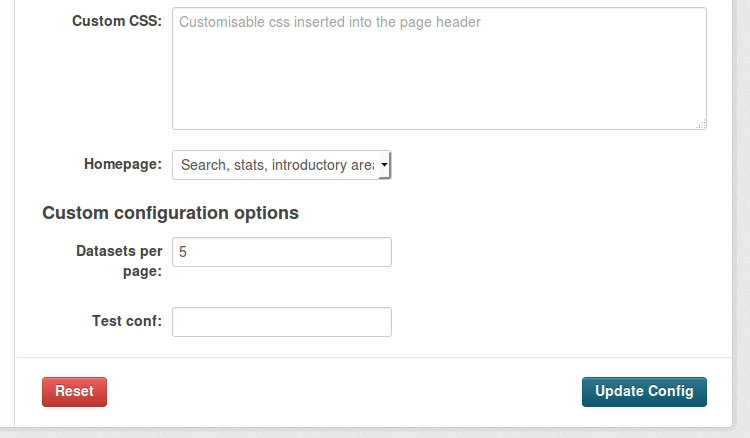

=============================================
Making configuration options runtime-editable
=============================================

Extensions can allow certain configuration options to be edited during
:ref:`runtime <runtime-config>`, as opposed to having to edit the
`configuration file`_ and restart the server.

.. _configuration file: ../maintaining/configuration.html#ckan-configuration-file

.. warning::

    Only configuration options which are not critical, sensitive or could cause the
    CKAN instance to break should be made runtime-editable. You should only add config options that you are comfortable
    they can be edited during runtime, such as ones you've added in your
    own extension, or have reviewed the use of in core CKAN.

.. note::

    Only sysadmin users are allowed to modify runtime-editable configuration options.

In this tutorial we will show how to make changes to our extension to make two
configuration options runtime-editable: :ref:`ckan.datasets_per_page` and a custom one named
``ckanext.example_iconfigurer.test_conf``. You can see the changes in the :py:mod:`~ckanext.example_iconfigurer` extension that's packaged with CKAN. If you haven't done yet, you
should check the :doc:`tutorial` first.

This tutorial assumes that we have CKAN running on the paster development server at http://localhost:5000, and that we are using the :ref:`API key <api authentication>` of a sysadmin user.

First of all, let's call the :py:func:`~ckan.logic.action.get.config_option_list` API action to see what configuration options are editable during runtime (the ``| python -m json.tool`` bit at the end is added to format the output nicely)::

    curl -H "Authorization: XXX" http://localhost:5000/api/action/config_option_list | python -m json.tool
    {
        "help": "http://localhost:5000/api/3/action/help_show?name=config_option_list",
        "result": [
            "ckan.site_custom_css",
            "ckan.theme",
            "ckan.site_title",
            "ckan.site_about",
            "ckan.site_url",
            "ckan.site_logo",
            "ckan.site_description",
            "ckan.site_intro_text",
            "ckan.homepage_style",
            "ckan.hola"
        ],
        "success": true
    }

We can see that the two options that we want to make runtime-editable are not on the list. Trying to update one of them with the :py:func:`~ckan.logic.action.update.config_option_update` action would return an error.

To include them, we need to add them to the schema that CKAN will use to decide which configuration options can be edited safely at runtime. This is done with the :py:meth:`~ckan.plugins.interfaces.IConfigurer.update_config_schema` method of the :py:class:`~ckan.plugins.interfaces.IConfigurer` interface.

Let's have a look at how our extension should look like:

.. literalinclude:: ../../ckanext/example_iconfigurer/plugin_v1.py

The ``update_config_schema`` method will receive the default schema for runtime-editable configuration options used by CKAN core. We can
then add keys to it to make new options runtime-editable (or remove them if we don't want them to be runtime-editable). The schema is a dictionary mapping configuration option keys to lists
of validator and converter functions to be applied to those keys. To get validator functions defined in CKAN core we use the :py:func:`~ckan.plugins.toolkit.get_validator` function.

.. note:: Make sure that the first validator applied to each key is the ``ignore_missing`` one,
    otherwise this key will need to be always set when updating the configuration.

Restart the web server and do another request to the :py:func:`~ckan.logic.action.get.config_option_list` API action::

    curl -H "Authorization: XXX" http://localhost:5000/api/action/config_option_list | python -m json.tool
    {
        "help": "http://localhost:5000/api/3/action/help_show?name=config_option_list",
        "result": [
            "ckan.datasets_per_page",
            "ckanext.example_iconfigurer.test_conf",
            "ckan.site_custom_css",
            "ckan.theme",
            "ckan.site_title",
            "ckan.site_about",
            "ckan.site_url",
            "ckan.site_logo",
            "ckan.site_description",
            "ckan.site_intro_text",
            "ckan.homepage_style",
            "ckan.hola"
        ],
        "success": true
    }

Our two new configuration options are available to be edited at runtime. We can test it calling the :py:func:`~ckan.logic.action.update.config_option_update` action::

    curl -X POST -H "Authorization: XXX" http://localhost:5000/api/action/config_option_update -d "{\"ckan.datasets_per_page\": 5}" | python -m json.tool
    {
        "help": "http://localhost:5001/api/3/action/help_show?name=config_option_update",
        "result": {
            "ckan.datasets_per_page": 5
        },
        "success": true
    }

The configuration has now been updated. If you visit the main search page at http://localhost:5000/dataset only 5 datasets should appear in the results as opposed to the usual 20.

At this point both our configuration options can be updated via the API, but we also want to make them available on the :ref:`administration interface <admin page>` so non-technical users don't need to use the API to change them.

To do so, we will extend the CKAN core template as described in the :doc:`/theming/templates` documentation.

First add the :py:meth:`~ckan.plugins.interfaces.IConfigurer.update_config` method to your plugin and register the extension ``templates`` folder:

.. literalinclude:: ../../ckanext/example_iconfigurer/plugin_v2.py

Now create a new file ``config.html`` file under ``ckanext/yourextension/templates/admin/`` with the following contents:

.. literalinclude:: ../../ckanext/example_iconfigurer/templates/admin/config.html
    :language: html

This template is extending the default core one. The first block adds two new fields for our configuration options below the existing ones. The second adds a helper text for them on the left hand column.

Restart the server and navigate to http://localhost:5000/ckan-admin/config. You should see the newfields at the bottom of the form:

Updating the values on the form should update the configuration as before.
