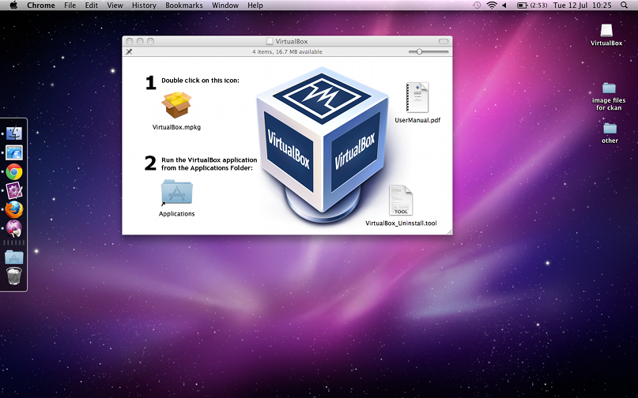
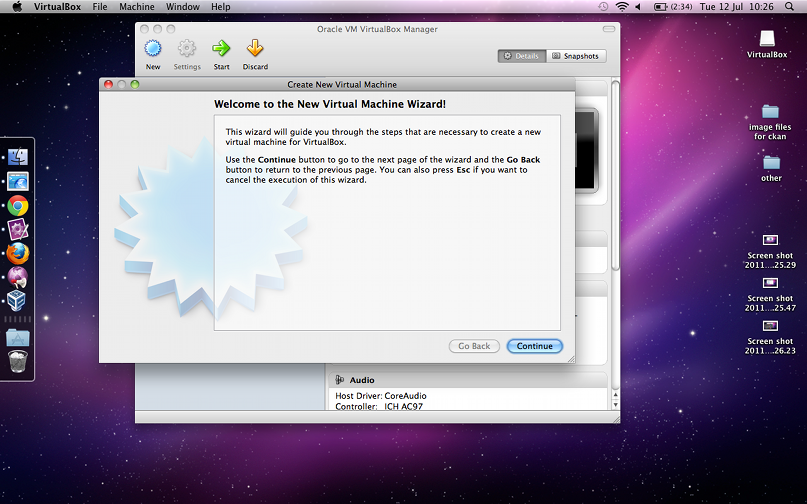
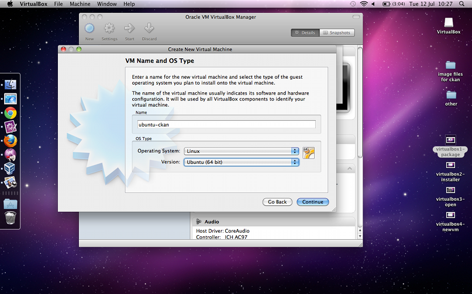
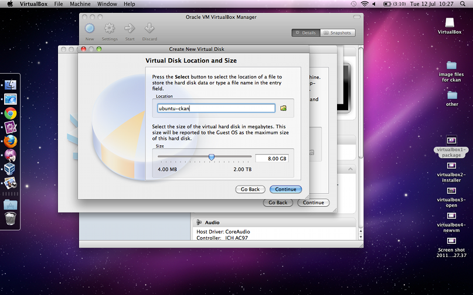
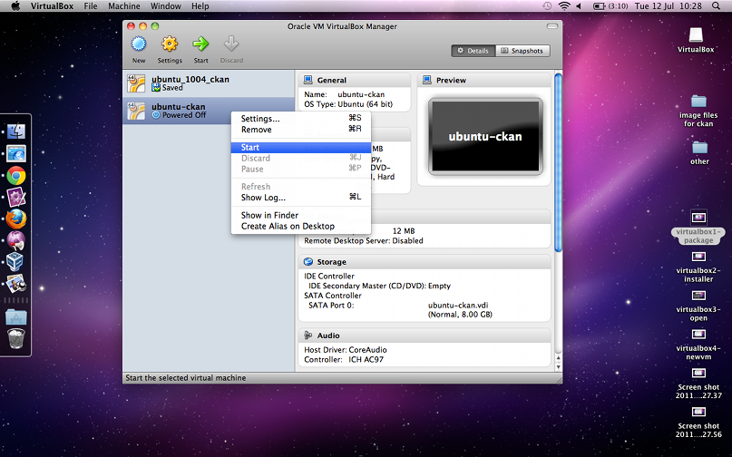
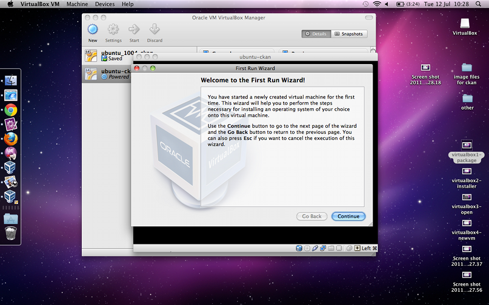
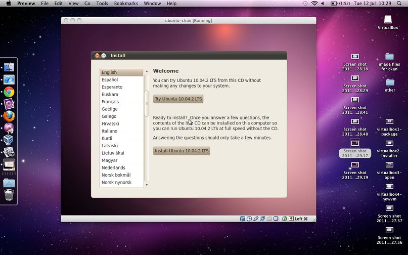

Setup on VirtualBox
===================

This option is suitable if you want to install CKAN on a machine running an OS other than Ubuntu 10.04. `VirtualBox <http://www.virtualbox.org>`_ lets you set up a virtual machine to run Ubuntu 10.04.

Pre-requisites and Downloads
****************************

First, check your machine meets `the pre-requisites for VirtualBox <http://www.virtualbox.org/wiki/End-user_documentation>`_. These include a fairly recent processor and some spare memory.

Then download the installation files.

* `Download the VirtualBox installer <http://www.virtualbox.org/wiki/Downloads>`_.
* `Download the Ubuntu image <http://www.ubuntu.com/download/ubuntu/download>`_ - make sure you choose Ubuntu 10.04.

Install VirtualBox
******************

.. note::

  This tutorial is for a Mac, but you can find instructions for installing VirtualBox on any OS `in the VirtualBox Manual <http://www.virtualbox.org/manual/ch02.html>`_.

To install, double-click on the VirtualBox installer:

Click Continue to begin the installation process. Enter your password when required, and wait for the installation to finish.

Create Your Virtual Machine
***************************

Go to Applications and open VirtualBox, then click New:

Give your VM a name - we'll call ours ``ubuntu_ckan``. Under **OS Type**, choose **Linux** and **Ubuntu (32 or 64-bit)**.

Leave the memory size as 512MB, and choose **Create new hard disk** (be aware that for production use you should probably allow 1.5GB RAM). This will open a new wizard:

You can leave the defaults unchanged here too - click **Continue**, and then **Done**, and **Done** again, to create a new VM.

Next, choose your VM from the left-hand menu, and click **Start**:

This will open the First Run Wizard:

After clicking **Continue**, you'll see **Select Installation Media**. This is where we need to tell our VM to boot from Ubuntu. Click on the file icon, and find your Ubuntu ``.iso`` file:

.. image:: images/virtualbox9-iso.png
   :alt: When you get to Select Installation Media, choose your Ubuntu .iso file

Click **Done**, wait for a few seconds, and you will see your Ubuntu VM booting.

Set Up Ubuntu
*************

During boot, you will be asked if you want to try Ubuntu, or install it. Choose **Install Ubuntu**:

You can then follow the usual Ubuntu installation process.

After Ubuntu is installed, from the main menu, choose **System > Administration > Update Manager**. You'll be asked if you want to install updates - say yes.

When all the updates have been downloaded and installed, you'll be prompted to reboot Ubuntu.

At this point, you can proceed to :ref:`run-package-installer`.

