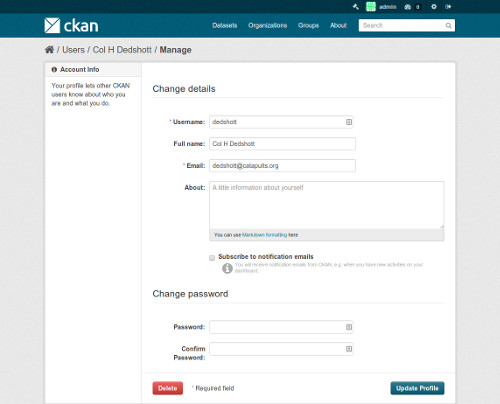

==============
Sysadmin guide
==============

This guide covers the administration features of CKAN 2.0, such as managing
users and datasets. These features are available via the web user interface to
a user with sysadmin rights. The guide assumes familiarity with the
:doc:`user-guide`.

Certain administration tasks are not available through the web UI but need
access to the server where CKAN is installed. These include the range of
configuration options using the site's "config" file, documented in
:doc:`configuration`, and those available via the :doc:`paster`.

.. warning::

    A sysadmin user can access and edit any organizations, view and change user
    details, and permanently delete datasets. You should carefully consider who has
    access to a sysadmin account on your CKAN system.

---------------------------
Creating a sysadmin account
---------------------------

Normally, a sysadmin account is created as part of the process of setting up
CKAN. If one does not already exist, you will need to create a sysadmin user,
or give sysadmin rights to an existing user. To do this requires access to the
server; see :ref:`create-admin-user` for details.  If another organization is hosting
CKAN, you will need to ask them to create a sysadmin user.

Adding more sysadmin accounts is done in the same way. It cannot be done via
the web UI.

-------------------------
Customizing look and feel
-------------------------

Some simple customizations to customize the 'look and feel' of your CKAN site
are available via the UI, at ``http://<my-ckan-url>/ckan-admin/config/``.

Here you can edit the following:

Site title
    This title is used in the HTML <title> of pages served by CKAN (which may
    be displayed on your browser's title bar). For example if your site title is
    "CKAN Demo", the home page is called "Welcome - CKAN Demo". The site title is
    also used in a few other places, e.g. in the alt-text of the main site logo.

Style
    Choose one of five colour schemes for the default theme.

Site tag line
    This is not used in CKAN's current default themes, but may be used in
    future.

Site tag logo
    A URL for the site logo, used at the head of every page of CKAN.

About
    Text that appears on the "about" page, ``http://<my-ckan-url>/about``. You
    can use `Markdown`_ here. If it is left empty, a standard text describing CKAN
    will appear.

.. _Markdown: http://daringfireball.net/projects/markdown/basics

Intro text
    This text appears prominently on the home page of your site.

Custom CSS
    For simple style changes, you can add CSS code here which will be added to
    the ``<head>`` of every page.

-----------------------------------
Managing organizations and datasets
-----------------------------------

A sysadmin user has full access to user accounts, organizations and datasets.
For example, you have access to every organization as if you were a member of
that organization. Thus most management operations are done in exactly the same
way as in the normal web interface.

For example, to add or delete users to an organization, change a user's role in
the organization, delete the organization or edit its description, etc, visit
the organization's home page. You will see the 'Admin' button as if you were a
member of the organization. You can use this to perform all organization admin
functions. For details, see the :doc:`user-guide`.

Similarly, to edit, update or delete a dataset, go to the dataset page and use
the 'Edit' button. As an admin user you can see all datasets including those
that are private to an organization. They will show up when doing a dataset
search.

Moving a dataset between organizations
======================================

To move a dataset between organizations, visit the dataset's Edit page. Choose
the appropriate entry from the "organization" drop-down list, and press "Save".

-----------------------------
Permanently deleting datasets
-----------------------------

A dataset which has been deleted is not permanently removed from CKAN; it is
simply marked as 'deleted' and will no longer show up in search, etc. The
dataset's URL cannot be re-used for a new dataset.

To permanently delete ("purge") a dataset:

* Navigate to the dataset's "Edit" page, and delete it.
* Visit ``http://<my-ckan-url>/ckan-admin/trash/``.

This page shows all deleted datasets and allows you to delete them permanently.

.. warning::

    This operation cannot be reversed!

.. note::

    At present, it is not possible to purge organizations or groups using the
    web UI. This can only be done with access to the server, by directly deleting
    them from CKAN's database.

--------------
Managing users
--------------

To find a user's profile, go to ``http://<my-ckan-url>/user/``. You can search
for users in the search box provided.

You can search by any part of the user profile, including their e-mail address.
This is useful if, for example, a user has forgotten their user ID. For
non-sysadmin users, the search on this page will only match public parts of the
profile, so they cannot search by e-mail address.

On their user profile, you will see an "Edit" button. CKAN displays the user
settings page. You can change any settings for the user, including their
username, name and password.

.. note::

    At present, it is not possible to delete users.
