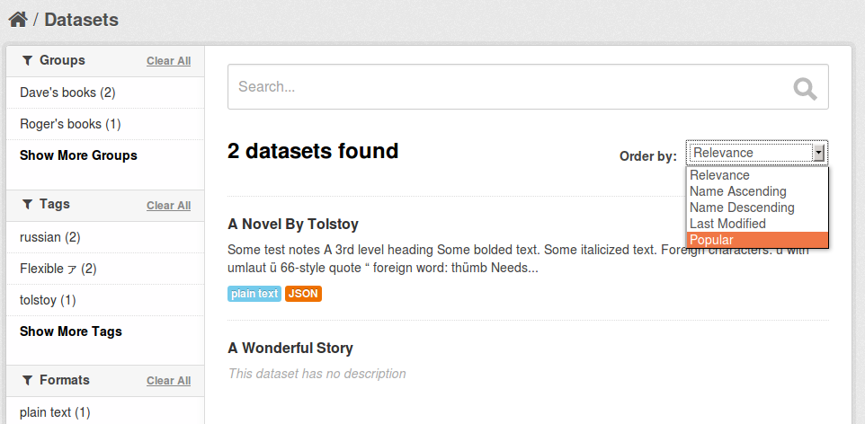

==================
Page View Tracking
==================

CKAN can track visits to pages of your site and use this tracking data to sort
your datasets by popularity. You can also export the tracking data to a CSV
file.

Enabling Page View Tracking
===========================

To enable page view tracking:

1. Put ``ckan.tracking_enabled = true`` in the ``[app:main]`` section of your
   CKAN configuration file (e.g. ``development.ini`` or ``production.ini``)::

    [app:main]
    ckan.tracking_enabled = true

   Save the file and restart your web server. CKAN will now record raw page
   view tracking data in your CKAN database as pages are viewed.

2. Setup a cron job to update the tracking summary data.

   When sorting datasets by popularity or exporting tracking data to file, CKAN
   uses a summarised version of the tracking data, not the raw tracking data
   that is recorded "live" as page views happen. The ``paster tracking update``
   and ``paster search-index rebuild`` commands need to be run periodicially to
   update this tracking summary data.

   You can setup a cron job to run these commands. On most UNIX systems you can
   setup a cron job by running ``crontab -e`` in a shell to edit your crontab
   file, and adding a line to the file to specify the new job. For more
   information run ``man crontab`` in a shell. For example, here is a crontab
   line to update the tracking data and rebuild the search index hourly::

    @hourly /usr/lib/ckan/bin/paster --plugin=ckan tracking update -c /etc/ckan/production.ini && /usr/lib/ckan/bin/paster --plugin=ckan search-index rebuild -r -c /etc/ckan/production.ini

   Replace ``/usr/lib/ckan/bin/`` with the path to the ``bin`` directory of the
   virtualenv that you've installed CKAN into, and replace ``/etc/ckan/production.ini``
   with the path to your CKAN configuration file.

   The ``@hourly`` can be replaced with ``@daily``, ``@weekly`` or
   ``@monthly``.

Sorting Datasets by Popularity
==============================

Once you've enabled page view tracking on your CKAN site, you can view datasets
most-popular-first by selecting ``Popular`` from the ``Order by:`` dropdown on
the dataset search page:

You can retrieve datasets most-popular-first from the
:doc:`CKAN API </api>` by passing ``'sort': 'views_recent desc'`` to the
``package_search()`` action.

.. tip::

 You can also sort datasets by total views rather than recent views. Pass
 ``'sort': 'views_total desc'`` to the ``package_search()`` API, or use the
 URL ``/dataset?q=&sort=views_total+desc`` in the web interface.

.. tip::

 Tracking summary data for datasets is available in the dataset dictionaries
 returned by, for example, the ``package_show()`` API::

  "tracking_summary": {
      "recent": 5,
      "total": 15
  },

.. note::

 Repeatedly visiting the same page will not increase the page's view count!
 Page view counting is limited to one view per user per page per day.

Exporting Tracking Data
=======================

You can export CKAN's page view tracking data to a CSV file using the
``paster tracking export`` command. For details, run ``paster tracking -h``.
